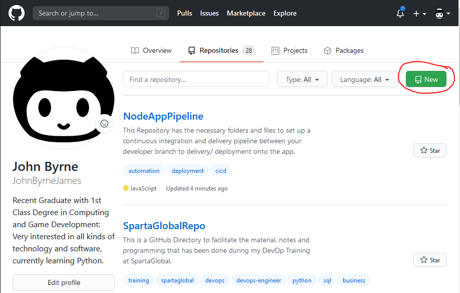
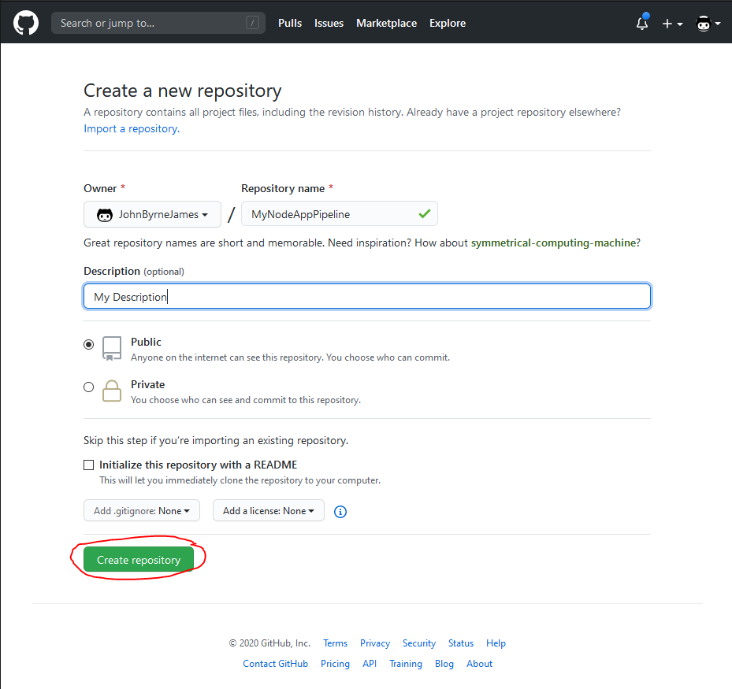
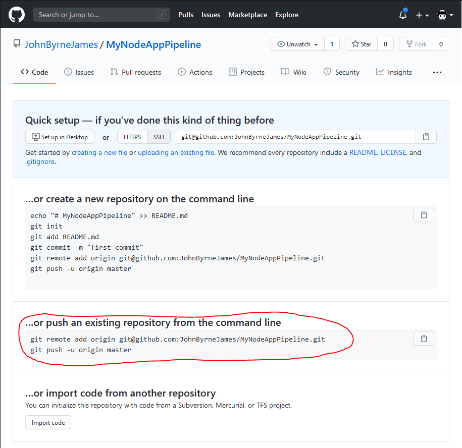
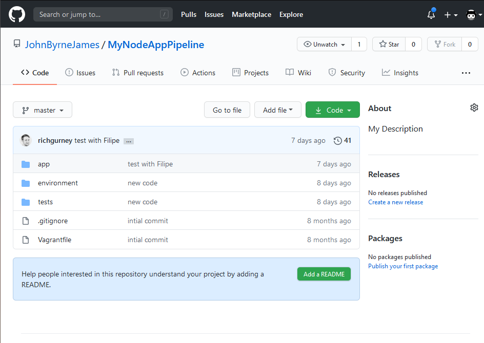
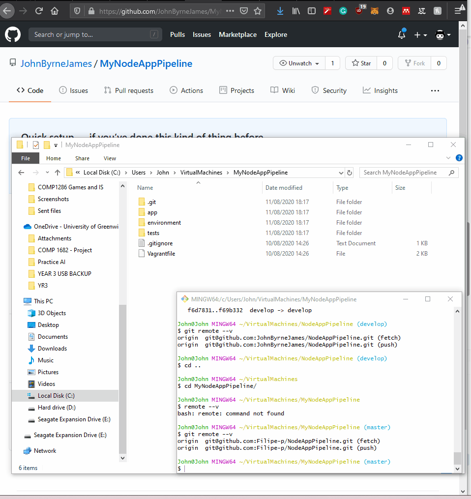

# Documentation of how to set up a CICD pipeline using Jenkins and AWS.

## Requirements

* Git Bash (Linux Terminal)
* AWS running EC2 Instance
* Downloaded/ Cloned this Repository into a folder on your local machine.
* Access to a Jenkins Server
* Access to a EC2 Instance

## What will be achieved?

The Automation of merging working code into the master branch of a version control system (Git) and Deployment of the app onto your EC2 instance. This will be done using Jenkins which is an automation server, it facilitates continuous integration and continuous delivery.

## Step 1 - Set up GitHub Repository

Now that you have downloaded/ cloned this Repository, open your git bash and navigate to the directory where you cloned the repositories documents.


_To auto complete a word use the `tab` key on your keyboard._

Once inside the directory inside GitBash. You need to unlink the Remote which will be attached to this GitHubs repository. The objective is to unlink that remote and link it to a Repository you have made on your own GitHub.

### Creating a Repository and linking it

**If you need help creating a Repository use the below Dropdown**

<details>
<summary> ❓ How to create a Repository on GitHub ❗ </summary> 
<p>




Go to your GitHub and Create a new Repository.



Now name the Repository something appropriate so you can refer back to what it is easily in the future.



When you create the Repo you can see there are all these instructions, we need the second one as we are using an existing Repo.

Copy the `git remote add origin git@github.com:JohnByrneJames/MyNodeAppPipeline.git`.

</p>
</details>

**If you need help replacing the remote in git use below Dropdown**

<details>
<summary> ❓ How to Replace the Remote | TEXT ❗ </summary>
<p>

**If you haven't already navigate to your directory using Git Bash**

Now go into your git bash and check which remote is currently connected to your Repository.

```bash
git remote --v
```

This will show you the remotes that your git directory is connected to. We need to remove that remote and add the one you have recieved when you created the GitHub Repository.

```bash
git remote rm origin
``` 

By default the remote is called origin, so the last command will remove the connection to that github, if you do `git remote --v` again it should not show anything. Next we are going to add our own remote.

```bash
git remote add origin git@github.com:JohnByrneJames/MyNodeAppPipeline.git

### - If SSH

git remote add <remote name> <github.com:<GitHubUsername>/<RepositoryName>.git 

### - If HTTP

git remote add <remote name> http://<github.com:<GitHubUsername>/<RepositoryName>.git 
```

Now when you use the `remote --v` command it should now show the Repository you just created as the origin. Now we need to rebase the origin on your Repository by making a push of the contents that should be in your Repository.

```bash
git push -u origin master
```

This will push the contents of your directory the GitHub, the `.gitignore` file will do all the exclusions for you. The `-u` is an optional setting that will set an upstream connection making the origin your default push location. the `origin master` part is the upstream origin, E.G. the GitHubs cloud storage.


Now go back to your GitHub Page and Refresh you should, now see the contents appear in that Github.




</p>
</details>

<details>
<summary> ❓ How to Replace the Remote | VIDEO ❗ </summary> 
<p>

**This is the video, it is a little easier if you are experienced using GitHub**



</p>
</details>

scp -i ~/.ssh/DevOpsStudents.pem -r app/ ubuntu@34.244.122.160:~/app
scp -i ~/.ssh/DevOpsStudents.pem -r environment/ ubuntu@34.244.122.160:~/environment