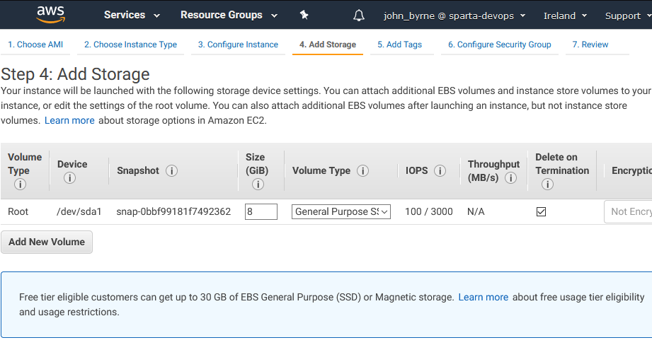
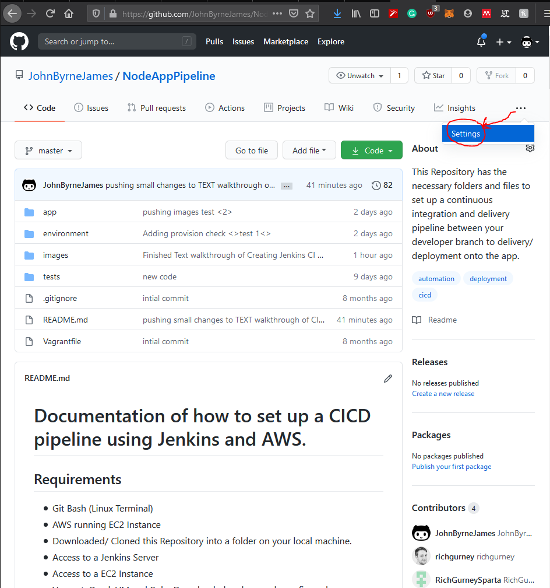
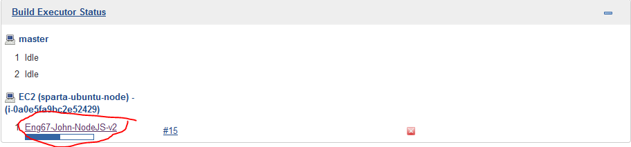
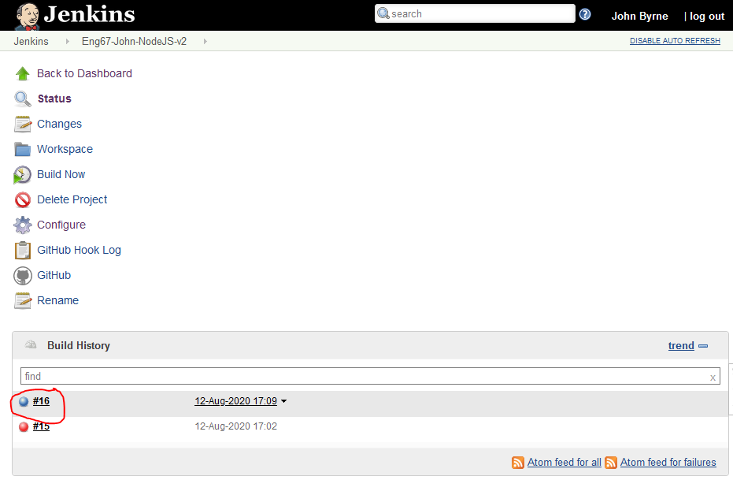
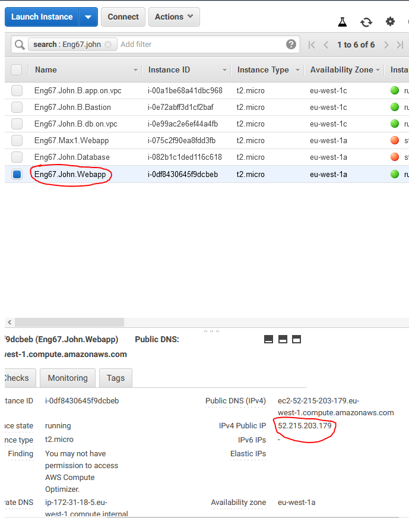
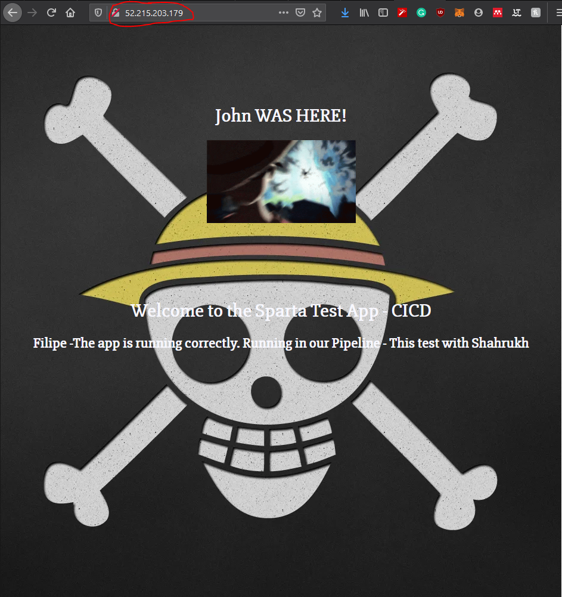
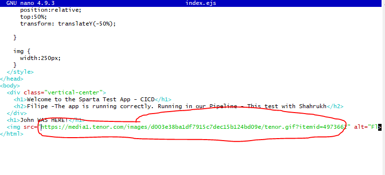

# Documentation of how to set up a CICD pipeline using Jenkins and AWS.

## Requirements

* Git Bash (Linux Terminal)
* AWS running EC2 Instance
* Downloaded/ Cloned this Repository into a folder on your local machine.
* Access to a Jenkins Server
* Access to a EC2 Instance
* Vagrant, OracleVM and Ruby Downloaded and properly configured on your local System. Find my guide to this [**HERE**](https://github.com/JohnByrneJames/VM_Proxy_Machine)

## What will be achieved?

The Automation of merging working code into the master branch of a version control system (Git) and Deployment of the app onto your EC2 instance. This will be done using Jenkins which is an automation server, it facilitates continuous integration and continuous delivery.

## Step 1 - Set up GitHub Repository

Now that you have downloaded/ cloned this Repository, open your git bash and navigate to the directory where you cloned the repositories documents.


_To auto complete a word use the `tab` key on your keyboard._

Once inside the directory inside GitBash. You need to unlink the Remote which will be attached to this GitHubs repository. The objective is to unlink that remote and link it to a Repository you have made on your own GitHub.

### Creating a Repository and linking it

**If you need help creating a Repository use the below Dropdown**

<details>
<summary> ❓ How to create a Repository on GitHub ❗ </summary> 
<p>


Go to your GitHub and Create a new Repository.


Now name the Repository something appropriate so you can refer back to what it is easily in the future.


When you create the Repo you can see there are all these instructions, we need the second one as we are using an existing Repo.

Copy the `git remote add origin git@github.com:JohnByrneJames/MyNodeAppPipeline.git`.

</p>
</details>

**If you need help replacing the remote in git use below Dropdown**

<details>
<summary> ❓ How to Replace the Remote | TEXT ❗ </summary>
<p>

**If you haven't already navigate to your directory using Git Bash**

Now go into your git bash and check which remote is currently connected to your Repository.

```bash
git remote --v
```

This will show you the remotes that your git directory is connected to. We need to remove that remote and add the one you have recieved when you created the GitHub Repository.

```bash
git remote rm origin
``` 

By default the remote is called origin, so the last command will remove the connection to that github, if you do `git remote --v` again it should not show anything. Next we are going to add our own remote.

```bash
## - My remote

git remote add origin git@github.com:JohnByrneJames/MyNodeAppPipeline.git

### - If SSH 

git remote add <remote name> <github.com:<GitHubUsername>/<RepositoryName>.git 

### - If HTTP

git remote add <remote name> http://<github.com:<GitHubUsername>/<RepositoryName>.git 
```

Now when you use the `remote --v` command it should now show the Repository you just created as the origin. Now we need to rebase the origin on your Repository by making a push of the contents that should be in your Repository.

```bash
git push -u origin master
```

This will push the contents of your directory the GitHub, the `.gitignore` file will do all the exclusions for you. The `-u` is an optional setting that will set an upstream connection making the origin your default push location. the `origin master` part is the upstream origin, E.G. the GitHubs cloud storage.


Now go back to your GitHub Page and Refresh. You should now see the contents appear in that Github, identical to the screenshot below.


</p>
</details>

<details>
<summary> ❓ How to Replace the Remote | VIDEO ❗ </summary> 
<p>

**This is the video, it is a little easier if you are experienced using GitHub**


</p>
</details>

## Step 2 - Testing VM on local machine

**In order to garuntee this will work, we are going to first test this**

If you haven't then go to this [**REPO**](https://github.com/JohnByrneJames/VM_Proxy_Machine) and follow the documentation to set up your VM, Vagrant and Ruby.

## Step 2.1 - Power Up Machine

All of the VM provisions have been prepared in advance, they are already included and properly configured in this folder. To begin the VM creation process make sure you are inside your directory again in the GitBash terminal. 

The first command to enter is:

```bash
vagrant up
```

This may take a few minutes to set up depending on your machines processing power/ virtualization capabilities...

_It should look something like the image below (this is about a minute in after the app VM has been created)_


Once that has completed, we need to test the app to see if it working.

## Step 2.2 - Navigate to the App and run it

Now we have started up the Virtual Machines we need to enter the virtual environment and test if the app is working. 


<details>
<summary> ❓ Enter Vagrant and Run NGINX server | TEXT ❗ </summary>
<p>

First lets enter the machine using `SSH`:

```bash
Vagrant SSH app
```

You should now be inside the VM, from here we need to navigate the location where we are going to run the app.

```bash
cd /home/ubuntu/app
```
_**Tip**: If you use the `tab` key it will auto complete the path so `ho` 🠆 `tab-press` 🠆 `home`_

Now we are inside the app folder, run the following commands to install the required dependencies and then run the app so it is listening on port 3000.

```bash
# Install dependencies
sudo npm install

# Test if installed correctly
sudo npm test

# Run App
sudo node app.js
```

_You should get these as your test results_


_After running `sudo node app.js` you should get `Your app is ready and listening on port 3000`_


Now we are able to connect to the NGINX server and view the two web page that we have running from our Virtual Machine.

| Web Page                              | Description                                                                   |
|---------------------------------------|-------------------------------------------------------------------------------|
| http://development.local/             | This is the home-page                                                         |
| http://development.local/fibonacci/10 | This will return fibonacci number at place   in 10 in the fibonacci sequence. |

If this loads then you have successfully completed this step!

</p>
</details>


<details>
<summary> ❓ Enter Vagrant and Run NGINX server | VIDEO ❗ </summary>
<p>

**Videos are easier if you are experienced with Vagrant**


If you can get the web page to load with the same contents as was shown in this Gif then you have completed this step!

</p>
</details>

**Now that we have confirmed the App is working**

We are going to turn off the VirtualMachines on our local computer to free up processing power. To do use the below commands.

```bash
vagrant halt 
```

This will close both the `app` and `db` virtual machines. If you want to double check they are down the you can use the command:

```bash
vagrant status
```


_The virtual machines should appear as `poweroff`._

## Step 3 - Set up EC2 Instance on AWS

**We are now going to be setting up our EC2 Machine on Amazon Web Services**

This is the machine where your App will be hosted and can be connected to via **SSH** in your local GitHub Bash terminal once you have correctly set up the Instance along with any necessary Security groups to allow your IP through.

First Navigate to EC2 under **Services** and **EC2**, from there click the button that says **Launch Instance**.

### Choose AMI

Here you want to choose a AMI that is identical to the version of your setup, in this case our we need **Ubuntu Server 16.04**


### Choose an Instance Type

Now we need to choose an instance type, we are going to go for a small EC2 as we are only running a small web app.


### Configure Instance

On This tab you need to configure you instance in terms of its networking behaviour. To keep it simple I simply added the network, subnet and Enabled auto assignment of IP for myself.


### Add Storage

Simply Skip this step and move to **Add Tags**.

_This is how mine looked_



### Add Tags

This Section is where you can add associations with your EC2 Instance so it can be easily located by yourself. 

```bash
<Stream>.<Name>.<EC2_Purpose>
```


### Configure Security Group

This section is where we set the security group of our EC2 instance, this is like the firewall of that instance. It will decide who is allowed in and out of the machine.

**This can be set up however you want but this is how mine looked** _With my IP scribbled out_


### Review

This last step is where you review all the configuration you have made and confirm it. You also need to add a key pair E.G. the **SSH** key pair that is needed to enter the instance. You can generate one or use one that is generated in your list. I am using the **DevOpsStudent** one for now as I have the private key on my system.

**The EC2 Instance should now be ready!!** It should appear in the running instances under the **EC2** services. Make sure it is running and you are done with this step.


## Step 4 - Set Up Continuous Integration with Jenkins

**From this point onwards, I am going to be following the process in respect to the Automation server set up at Sparta, these can be altered to most configurations.**

Firstly we need to set up a development branch, this can be easily within the same GitBash terminal we were using before. This will be the branch that we will push our code to, the integration will be done by Jenkins.

Inside your GitBash terminal enter the following commands:

```bash
# Create the branch locally
git checkout -b develop

# Push branch to origin on GitHub (UpStream)
git push --set-upstream origin develop
```

Now when we eventually set up the CI (Continuous Integration) we want to be able to change something that triggers the **Job**. So create a `.md` using:

```bash
# Create file that will change and trigger merge
touch DevBranch.md

# Enter file and make slight change
nano DevBranch.md
```

_I simply added `this was done in the DevBranch`._

_Exit the nano with `Ctrl+s` and `Ctrl+x`_


## Step 4.1 - Set up Jenkins Job for CI (Continuous Integration) and CD (Continuous Delivery)

### Overview:

* **CI Job** - Get code from develop branch, merge it into the master branch if it is a success and all the tests pass. This then triggers the next job...
* **CD Job** - This job will Copy over the `app` and `environment` into the EC2 instance using `SCP` and then SSH into the machine and run the provisions to up the web server. We will change the image of the Welcome page, using this automation pipeline to visually identify changes.

### Creating CI Job

<details>
<summary> ❓ Creating the CI Job | TEXT ❗ </summary> 
<p>

Once logged into your Jenkins, click `New item` at the top of the page.

**Job Configuration**
1. **Freestyle project**
2. **Enter an item name**, you can follow any naming convention, but end with CI for continuous integration.

_This is how it should look._


Once you have created the Job, you need to configure it. In order to make this stage of the setup easier to follow, refer to the table below.

_Any configurations that are left out were left default_

| **GENERAL**                              | -                                                                                                                               |
|------------------------------------------|---------------------------------------------------------------------------------------------------------------------------------|
| Description                              | Anything can go here, describing the job and its course of action for others to see.                                            |
| Discard old Builds                       | **Ticked**                                                                                                                      |
| _Strategy_                               | Log Rotation                                                                                                                    |
| _Max # of builds to keep_                | 2                                                                                                                               |
| GitHub project                           | **Ticked**                                                                                                                      |
| _Project URL_                            | URL of GitHub Repository http:<github.com>/<username>/<GitHub Repo>/                                                            |
| **OFFICE 365 CONNECTOR**                 | - SKIP THIS FOR NOW -                                                                                                           |
| _Restrict where this project can be run_ | sparta-ubuntu-node (EC2 Instance to run test)                                                                                   |
| **SOURCE CODE MANAGEMENT**               | -                                                                                                                               |
| Git                                      | **Ticked**                                                                                                                      |
| _Repository URL_                         | Either SSH or HTTPS Link to the Repository **Include** Credentials for SSH (private key)                                        |
| _branches to build_                      | Branch Specifier */dev* (This * is a wildcard in Regex, it reads from all development branches) In our case the develop branch. |
| **BUILD TRIGGERS**                       | -                                                                                                                               |
| GitHub hook trigger for GITScm polling   | **Ticked**                                                                                                                      |
| **BUILD ENVIRONMENT**                    | -                                                                                                                               |
| Provide Node & npm bin/ folder to PATH   | **Ticked**                                                                                                                      |
| _NodeJS Installation_                    | Sparta-Node-JS, here is where you set up the Node JS installation path (Not important)                                          |
| **BUILD**                                | -                                                                                                                               |
| **Click** Add build step                 | **Select** Execute Shell  Insert the following: ``` cd app npm install npm test  ```                                            |
| **POST-BUILD ACTIONS**                   | -                                                                                                                               |
| **Click** Add post-build action          | **Select** Git Publisher                                                                                                        |
| _Push Only if Build succeeds_            | **Ticked**                                                                                                                      |
| _Merge Results_                          | **Ticked**                                                                                                                      |
| _Branches_                               | **Branch to Push** : master  (master branch in our Repo)  **Target remote name** : origin  (our remote name)                    |
| **Apply** and **Save**                   | -                                                                                                                               |

This is the CI Job set up and ready to be used. It should now be linked to the Repository we recently made. Now you are ready for the next step.

</p>
</details>

<details>
<summary> ❓ Creating the CI Job | VIDEO ❗ </summary> 
<p>

This video will give you a more Visual observation of the finished configraution of the Job.


This is the CI Job set up and ready to be used. It should now be linked to the Repository we recently made. Now you are ready for the next step.

</p>
</details>

## Step 4.2 - Set Up WebHook between GitHub Repository and Jenkins Automation Server

Now we are going to link the Job we just created to our GitHub using a **webhook**. A webhook is a custom callback or sometimes referred to as a Reverse API. It essentially tells the Job on Jenkins to build whenever it detects a change being pushed to the repository.

In this case the Job will start to build and if the tests it runs are successful it will then automatically **INTEGRATE**/**MERGE** the development branch it is monitoring into the master branch.


<details>
<summary> ❓ Setting up a WebHook | TEXT ❗ </summary> 
<p>

The first thing you need to do is navigate to your Directory and locate the webhooks setting.



Then Go into the _Webhooks_ tab on the right hand side


Add a new webhook


**Configuration**
* You need to add the IP of your Jenkins server followed by `/github-webhook/`
* Content Type does not matter but I prefer **JSON**
* Select **Add Webhook** 


When added, you should get a small green tick when you view it in the webhooks tab again. This means the webhook got a successful response when trying to ping the Jenkins automation server.


</p>
</details>

<details>
<summary> ❓ Setting Up a WebHook | VIDEO ❗ </summary> 
<p>


This is the webhook set up and ready to go!

</p>
</details>


## Step 4.3 Test CI

**Now that is all set up** we want to test that it is working.

**Go to your GitBash** and navigate into the Repositories terminal. Make sure you are on the develop branch using `git checkout develop`.

Here you have a change you haven't added yet, which we set up earlier. Pushing this change will trigger the jenkins job.

```bash
git add .

# Commit change with meaningful message
git commit -m "message"

# Push to GitHub
git push
```

Now go to your **Jenkins Dashboard** and your Job should see the Job that has been triggered running.



Once it has finished Running the little status Orb should be **Blue**, this means it has passed successfully. If it is **Red** then it has failed, read the console output or go back some steps if you are getting this issue.



If you go back to your GitHub Repository you should now see that file you created in your **Develop** branch in your **Master** branch as it has now been merged automatically by Jenkins.

## Step 5 - Setting up the Node App inside your AWS Instance

First Go to AWS and locate your **EC2** Instances. Make sure it is running, click the Instance and copy its **IPv4 public IP**.



Now we need to copy our `app` and `environment` folder into the instance. To do that we need to use the `scp` command like so. To connect I perform a `scp` command, then I use `-i` to send my identification, this matches with the public SSH key that was given to the Instance in my case. I then specify which folder I want to copy over and to where.

```bash
# My SCP 
scp -i ~/.ssh/DevOpsStudents.pem -r app/ ubuntu@3.250.67.195:/home/ubuntu/
scp -i ~/.ssh/DevOpsStudents.pem -r environment/ ubuntu@3.250.67.195:/home/ubuntu/

# Copy over the App folder
scp -i ~/.ssh/<your key> -r app/ ubuntu@<Ipv4 of your instance>:/home/ubuntu/

# Copy over the App folder
scp -i ~/.ssh/<your key> -r environment/ ubuntu@<Ipv4 of your instance>:/home/ubuntu/
```

This should copy over the two folders into your instance on AWS. Now we want to go into the instance and run the app provision.

```bash
# My SSH 
ssh -i ~/.ssh/DevOpsStudents.pem ubuntu@54.217.53.47

# SSH into the AWS web app instance
ssh -i ~/.ssh/<your key> ubuntu@<Ipv4 of your instance>
```

**Inside the EC2** machine:

```bash
#  Go into the environment folder
cd /home/ubuntu/environment/app

# Give the provision folder permissions
chmod +x provision.sh

# Run the provision
sudo ./provision

# Go back to your app folder
cd ..
cd ..
cd app

# Install the Dependencies and then run the tests
sudo npm install
sudo npm test
```

Your app should all be working now. If you want to check then run it and view it in your browser using the **IPv4** address of your EC2 Machine. You can run it with the command `sudo node app.js`.



If you see this page, you have completed this step!!

**Note**

To exit the EM2 in the GitBash terminal use the shortcut `Ctrl+D`


## Step 6 - Set up CD Job on Jenkins and change Web page to prove its working.


<details>
<summary> ❓ Setting up a CD Job | TEXT ❗ </summary> 
<p>

| **GENERAL**                              | -                                                                                                                                                                                                                                                                                                                                                                                                 |
|------------------------------------------|---------------------------------------------------------------------------------------------------------------------------------------------------------------------------------------------------------------------------------------------------------------------------------------------------------------------------------------------------------------------------------------------------|
| Description                              | Anything can go here, describing the job and its course of action for others to see.                                                                                                                                                                                                                                                                                                              |
| Discard old Builds                       | **Ticked**                                                                                                                                                                                                                                                                                                                                                                                        |
| _Strategy_                               | Log Rotation                                                                                                                                                                                                                                                                                                                                                                                      |
| _Max # of builds to keep_                | 2                                                                                                                                                                                                                                                                                                                                                                                                 |
| GitHub project                           | **Ticked**                                                                                                                                                                                                                                                                                                                                                                                        |
| _Project URL_                            | URL of GitHub Repository http:<github.com>/<username>/<GitHub Repo>/                                                                                                                                                                                                                                                                                                                              |
| **Office 365 Connector**                 | - SKIP THIS FOR NOW -                                                                                                                                                                                                                                                                                                                                                                             |
| _Restrict where this project can be run_ | sparta-ubuntu-node (EC2 Instance to run test)                                                                                                                                                                                                                                                                                                                                                     |
| **Source Code Management**               | -                                                                                                                                                                                                                                                                                                                                                                                                 |
| Git                                      | **Ticked**                                                                                                                                                                                                                                                                                                                                                                                        |
| _Repository URL_                         | Either SSH or HTTPS Link to the Repository **Include** Credentials for SSH (private key)                                                                                                                                                                                                                                                                                                          |
| _branches to build_                      | Branch Specifier */master (This * is a wildcard in Regex, it reads from all development branches) In our case the develop branch.                                                                                                                                                                                                                                                                 |
| **Build Triggers**                       | -                                                                                                                                                                                                                                                                                                                                                                                                 |
| Build after other projecst are built     | **Project to watch** : <name of CI Job>  Trigger only if build is stable : **Ticked**                                                                                                                                                                                                                                                                                                             |
| **Build Environment**                    | -                                                                                                                                                                                                                                                                                                                                                                                                 |
| SSH Agent                                | **SSH** Credentials                                                                                                                                                                                                                                                                                                                                                                               |
| **Build**                                | -                                                                                                                                                                                                                                                                                                                                                                                                 |
| **Click** Add build step                 | **Select** Execute Shell  Insert the following: ```scp -o "StrictHostKeyChecking=no" -r app/ ubuntu@<Ipv4 of EM2>:/home/ubuntu/ scp -o "StrictHostKeyChecking=no" -r environment/ ubuntu@<Ipv4 of EM2>:/home/ubuntu/environment ssh -o "StrictHostKeyChecking=no" ubuntu@<Ipv4 of EMC> <<EOF          sudo bash ./environment/app/provision.sh  # Rerun provision to update welcome page EOF  ``` |
| **Apply** and **Save**                   | -                                                                                                                                                                                                                                                                                                                                                                                                 |

This is the configuration of the CD Job it will be automatically triggered by the CI Job and update the Web Pages welcome page via automating the **SSH** process we previously did manually.

</p>
</details>

**Now we need to test the App and see if it is working**

For that you are going to have to go back to your GitBash and make a change to your Welcome page.

To do this we are going to navigate to the file and change it to a custom image file. 

```bash
# navigate to the views folder
cd app/views/

# Nano into index and change it with a custom image url from google
nano index.ejs
```

I want to add this image to my new welcome page.


Now change this line with your own custom **HTTP** url of an image.



```bash
# Now push the changes and it should trigger the jobs
git add .
git commit -m "message"
git push
```

**Once the jobs have been completed** navigate back to the page of your EM2 NGINX instance, using your **IPv4** address. This should be change like mine has below.

